# Dynamic Lead Gen with Agents - Project Context

## Project Overview
This application helps client users create multi-step forms for lead generation with two key AI-powered capabilities:
1. **Adaptive Question Selection**: Questions are ordered and selected based on user responses
2. **Lead Qualification**: Automated assessment of whether answers indicate a qualified lead

The system uses AI agents to create intelligent, engaging forms that maximize conversion and lead quality.

## Application Architecture

### Core Capabilities
1. **Form Creation**: Marketers set up lead gen forms (initially manual config, later agent-assisted)
2. **Adaptive Forms**: Public-facing multi-step forms with AI-driven question flow
3. **Lead Scoring & Messaging**: Automated lead qualification with personalized responses
4. **Analytics & Reporting**: Daily insights and strategy recommendations for marketers

### Technology Stack
- **Backend**: Python 3.12+ with LangChain & LangGraph
- **Session Management**: Starlette SessionMiddleware with Redis backend (OWASP-compliant HTTP-only cookies)
- **Database**: Supabase for data storage and real-time updates
- **Frontend**: React.js with Tailwind CSS v4 for theming
- **Package Manager**: uv (modern Python package manager)
- **Configuration**: YAML-based configuration management
- **Containerization**: Docker & Docker Compose for full-stack development

### Project Structure
- **Main application**: `main.py` - Entry point for the application
- **Backend**: `/backend/app/` - Core application modules
  - `handlers/` - Request/response handlers
  - `llm/` - Language model integrations
  - `ml/` - Machine learning components
  - `prompt_engineering/` - Prompt templates and engineering
  - `utils/` - Utility functions and configuration loading
  - `routes/` - API endpoints for survey operations
  - `graphs/` - LangGraph implementations for survey flow
    - `supervisors/` - LLM agents that coordinate survey strategy and validation
    - `nodes/` - Individual processing nodes (LLM agents and pure logic)
    - `toolbelts/` - External API integrations (Tavily, Google Maps)
  - `session_manager.py` - Starlette SessionMiddleware integration
  - `session_store.py` - Custom Redis session store
  - `middleware/` - Security, validation, and logging middleware
- **Database**: `/database/` - Database migrations and population scripts
  - `001_initial_schema.sql` - Complete database schema with all tables
  - `002_populate_example_data.sql` - 5 example business scenarios with 52 questions
  - `business_scenarios.md` - Documentation of all business cases
  - `test_database_population.py` - Comprehensive test suite
- **Notebooks**: Development and experimentation in `/notebooks/`
  - `poc_chain.ipynb` - Main proof of concept using LangGraph
  - `PoC_Survey_Agents.ipynb` - Survey agents implementation
- **Configuration**: `/config/` - YAML configuration files
- **Data**: `/data/` - Input data, outputs, and cached results
  - Survey questions and client data (now primarily database-driven)
  - Embeddings and cached LLM responses

## Development Setup
```
docker-compose up -d
```

## Database Setup
The system includes comprehensive database population with 5 example business scenarios:

1. **Pawsome Dog Walking** - Pet services (10 questions)
2. **Metro Realty Group** - Real estate (12 questions)
3. **TechSolve Consulting** - Software consulting (11 questions)
4. **FitLife Personal Training** - Health & fitness (10 questions)
5. **Sparkle Clean Solutions** - Home cleaning (9 questions)

**Total: 52 questions** across all forms with proper scoring rubrics and business logic.

### Quick Database Setup
```bash
# Run setup script for guided database initialization
uv run python3 database/setup_and_test.py
```

## LangGraph Flow Architecture

### Core Flow Design
Current focus is on capabilities #2 and #3 (Adaptive Forms and Lead Scoring):

See `/.llm/final-supervisor-architecture.md` for information.

```mermaid
graph TB
    Start([Start: User Arrives with UTM]) --> InitTrack[initialize_session_with_tracking<br/>📊 LOGIC - Database ops + UTM]

    InitTrack --> SA[Survey Administration Supervisor<br/>🤖 LLM AGENT - Intelligent question strategy]

    SA --> QS[question_selection_node<br/>🤖 LLM AGENT - AI-driven selection within rules]
    SA --> QP[question_phrasing_node<br/>🤖 LLM AGENT - Rewrites questions]
    SA --> EN[engagement_node<br/>🤖 LLM AGENT - Generates messages]

    QS --> QP
    QP --> EN
    EN --> PrepStep[prepare_step_for_frontend<br/>📊 LOGIC - Data formatting]

    PrepStep --> Wait{Wait for User Response}
    Wait --> CheckAndMark[check_and_handle_abandonment<br/>📊 LOGIC - Combined: detect + mark abandoned]
    CheckAndMark -->|Abandoned| FinalSave

    Wait --> SaveResponses[save_and_validate_responses<br/>📊 LOGIC - Save to DB + update state]

    SaveResponses --> Score[calculate_lead_score<br/>📊 LOGIC - Mathematical scoring]

    Score --> LI[Lead Intelligence Supervisor<br/>🤖 LLM AGENT - Validate score + Tools]

    LI --> Tools{Need External Data?}
    Tools -->|Yes| Tavily[🔧 Tavily Web Search]
    Tools -->|Yes| Maps[🔧 Google Maps API]
    Tools --> Validate[validate_and_adjust_score<br/>🤖 LLM AGENT - Final score validation]

    Tavily --> Validate
    Maps --> Validate

    Validate --> Route{Lead Status?}

    Route -->|Need More| SA
    Route -->|Qualified/Maybe/No| Message[generate_completion_message<br/>🤖 LLM AGENT - Custom message by status]

    Message --> FinalSave[📊 LOGIC - Final database update]

    FinalSave --> End([End])
```


### Supervisor & Node Classification

| Node/Component | Type | Uses LLM? | Purpose |
|----------------|------|-----------|---------|
| **initialize_session_with_tracking** | 📊 LOGIC | No | Database operations, UTM tracking |
| **Survey Administration Supervisor** | 🤖 LLM AGENT | Yes | Overall question strategy coordination |
| **question_selection_node** | 🤖 LLM AGENT | Yes | **AI-driven selection within rules** |
| **question_phrasing_node** | 🤖 LLM AGENT | Yes | Rewrites questions for better engagement |
| **engagement_node** | 🤖 LLM AGENT | Yes | Generates motivational messages |
| **prepare_step_for_frontend** | 📊 LOGIC | No | Formats data for API response |
| **check_and_handle_abandonment** | 📊 LOGIC | No | Time-based detection + DB update |
| **save_and_validate_responses** | 📊 LOGIC | No | Database persistence + state update |
| **calculate_lead_score** | 📊 LOGIC | No | Mathematical scoring algorithm |
| **Lead Intelligence Supervisor** | 🤖 LLM AGENT | Yes | **Validates scores + decides on tools** |
| **Tavily Search** | 🔧 TOOL | No | External web search API |
| **Google Maps API** | 🔧 TOOL | No | Distance/location calculations |
| **validate_and_adjust_score** | 🤖 LLM AGENT | Yes | **Final score validation and adjustment** |
| **generate_completion_message** | 🤖 LLM AGENT | Yes | Custom messages by status |
| **Final database update** | 📊 LOGIC | No | Session completion |

### Key Features

✅ **Intelligent Question Selection**: LLM chooses questions within business rules  
✅ **Question Flow Strategy**: Supervisor coordinates selection + phrasing + engagement  
✅ **Score Validation**: LLM reviews mathematical score for business sense  
✅ **Tool Integration**: External validation when Lead Intelligence Supervisor deems necessary  
✅ **Maybe Handling**: Marked in database for separate workflow  
✅ **Non-deterministic Question Flow**: Each survey adapts to user responses  
✅ **Business Rule Compliance**: AI selection within defined constraints

### Lead Classification & Actions
- **"Yes" leads**: Real-time notification + personalized completion message + email
- **"Maybe" leads**: Daily batch email to client + personalized completion message
- **"No" leads**: Database storage only + generic completion message
- **Failed required questions**: Immediate routing to "no" completion flow

### Data Management

**Auto-save Strategy**:
- Form state saved automatically after each step
- Individual question responses stored for analytics
- Complete state maintained for form resumption
- Final status update when form completed/abandoned

**Database Schema (Supabase)**:
- `clients` table: Business profiles and AI context information
- `forms` table: Form configurations with scoring thresholds
- `form_questions` table: Individual questions with scoring rubrics
- `lead_sessions` table: Session tracking with abandonment detection
- `responses` table: Individual question-answer pairs with timestamps
- `tracking_data` table: UTM parameters and marketing attribution
- `session_snapshots` table: State recovery and resumption
- `lead_outcomes` table: Conversion tracking for ML learning

## Current Implementation Status
- **✅ Core System**: Complete LangGraph flow with all phases implemented
- **✅ Database Integration**: Full database schema with 5 example business scenarios
- **✅ API Layer**: REST endpoints with consistent `{"success": boolean, "data": object, "message": text}` format
- **✅ Session Management**: OWASP-compliant HTTP-only cookies with Redis backend via Starlette SessionMiddleware
- **✅ Security**: Comprehensive middleware stack (rate limiting, input validation, response sanitization)
- **✅ Data Population**: 52 questions across 5 diverse business types
- **✅ Testing Suite**: Comprehensive validation with 100% pass rate
- **✅ UTM Tracking**: Marketing attribution and abandonment detection
- **✅ Lead Scoring**: Automated qualification with personalized messaging
- **✅ Docker Environment**: Full containerization with backend, frontend, and Redis services
- **🚧 Frontend**: React.js + Tailwind v4 (in development)
- **🚧 Admin Interface**: Web-based form management (planned)

### Available Test Forms
Ready-to-use form IDs for testing:
- `f1111111-1111-1111-1111-111111111111` - Pawsome Dog Walking
- `f2222222-2222-2222-2222-222222222222` - Metro Realty Group
- `f3333333-3333-3333-3333-333333333333` - TechSolve Consulting
- `f4444444-4444-4444-4444-444444444444` - FitLife Personal Training
- `f5555555-5555-5555-5555-555555555555` - Sparkle Clean Solutions

## Business Rules
- Required questions have `required: true` AND scoring rubrics
- Contact info (name, email) only required for qualified leads
- Users must see minimum 4 questions before failure (unless hard fail)
- Tough qualifying questions should not appear early in flow
- Form abandonment data must be tracked and analyzed

## Development Notes
- Use `python3` in all commands
- Prefer editing existing files over creating new ones
- Database-first approach: All questions and client data stored in Supabase
- Configuration is centralized in `/config/` directory
- All LLM interactions should be mockable for testing
- Design for future multilingual support
- Tailwind v4 configuration required for theming

## Session Management Architecture

### Security Implementation
- **HTTP-only Cookies**: Session data never exposed to client-side JavaScript
- **OWASP Compliance**: Follows security best practices for session management
- **Redis Backend**: Sessions stored in Redis with automatic TTL (30 minutes)
- **Middleware Integration**: Starlette SessionMiddleware with custom Redis store
- **Scoped Cookies**: Session cookies limited to `/api/survey` path
- **Environment-specific HTTPS**: HTTPS-only cookies in production

### Session Files
- **`session_manager.py`**: Starlette SessionMiddleware integration helpers
- **`session_store.py`**: Custom Redis session store implementing Starlette interface
- **`main.py`**: SessionMiddleware configuration with Redis backend

## API Testing Examples

All APIs return consistent format: `{"success": boolean, "data": object, "message": text}`

### Start a Survey Session
```bash
curl -X POST http://localhost:8000/api/survey/start \
  -H "Content-Type: application/json" \
  -c cookies.txt \
  -d '{
    "form_id": "f1111111-1111-1111-1111-111111111111",
    "utm_source": "google",
    "utm_campaign": "dog_walking_test"
  }'
```

### Submit Responses (using session cookie)
```bash
curl -X POST http://localhost:8000/api/survey/step \
  -H "Content-Type: application/json" \
  -b cookies.txt \
  -d '{
    "responses": [
      {
        "question_id": 1,
        "answer": "John Smith"
      }
    ]
  }'
```

### Check Session Status
```bash
curl -X GET http://localhost:8000/api/survey/status \
  -H "Content-Type: application/json" \
  -b cookies.txt
```

### Mark Session as Abandoned
```bash
curl -X POST http://localhost:8000/api/survey/abandon \
  -H "Content-Type: application/json" \
  -b cookies.txt
```

### Validate Form Availability
```bash
curl -X GET http://localhost:8000/api/survey/forms/f1111111-1111-1111-1111-111111111111/validate
```

## Recent Implementation Updates (Aug 2025)

### Session Management Migration
**Migration from fastapi-sessions to Starlette SessionMiddleware:**
- **Reason**: fastapi-sessions had import issues and didn't include Redis backend out of the box
- **Solution**: Implemented Starlette's built-in SessionMiddleware with custom Redis store
- **Result**: More stable, better integrated, simpler codebase

**Key Changes Made:**
1. Created `RedisSessionStore` class implementing Starlette session interface
2. Updated `session_manager.py` to use `request.session` directly
3. Modified all API endpoints to use session cookies instead of explicit session IDs
4. Fixed `abandon` endpoint to properly load `form_id` from database like other endpoints
5. Added comprehensive middleware stack in correct order for security

**API Consistency Improvements:**
- All endpoints now return consistent `{"success": boolean, "data": object, "message": text}` format
- Created `response_helpers.py` with standardized response functions
- Added response sanitization middleware with timestamps and sanitization markers
- Improved error handling with proper HTTP status codes

**Security Enhancements:**
- HTTP-only cookies prevent XSS attacks on session data
- Session cookies scoped to `/api/survey` path only
- Environment-specific HTTPS enforcement
- 30-minute session timeout with Redis TTL
- Comprehensive middleware stack: security headers, rate limiting, input validation, response sanitization

**Docker Environment Improvements:**
- Full containerization with backend, frontend, and Redis services
- Working Docker Compose setup with proper networking
- Environment-specific configuration with development vs production settings

### Testing Strategy
- Test flow with different lead quality scenarios
- Validate scoring logic against business requirements
- Test abandonment prevention and re-engagement
- Verify database state consistency
- Test real-time vs batch notification systems
- **New**: End-to-end session management testing with cookie persistence
- **New**: API consistency validation across all endpoints
- **New**: Security middleware integration testing
