# User Data Flow Architecture

This diagram shows how user data flows through the entire system from frontend to backend to admin interface.

```mermaid
graph TB
    subgraph "Frontend - Form App (Port 5173)"
        User["👤 User"] --> Form["📝 Form Interface<br/>React + Zustand"]
        Form --> FormStore["🗄️ Form Store<br/>- Session State<br/>- Responses<br/>- Theme Data"]
        FormStore --> API["🔌 API Client<br/>HTTP-only Cookies"]
    end
    
    subgraph "Backend - API Server (Port 8000)"
        API --> SurveyRoutes["📡 Survey API Routes<br/>/api/survey/*"]
        SurveyRoutes --> SessionMgr["🍪 Session Manager<br/>Redis + HTTP-only Cookies"]
        SessionMgr --> Snapshots[("📸 Session Snapshots<br/>Supabase")]
        
        SurveyRoutes --> LangGraph["🧠 LangGraph Engine<br/>- Survey Admin Supervisor<br/>- Lead Intelligence Agent"]
        LangGraph --> Database[("🗃️ Database - Supabase<br/>- lead_sessions<br/>- responses<br/>- tracking_data<br/>- clients<br/>- forms")]
        
        Database --> AdminAPI["👨‍💼 Admin API Routes<br/>/api/admin/*"]
        LangGraph --> AdminAPI
    end
    
    subgraph "Admin Interface (Port 5174)"
        AdminAPI --> AdminApp["📊 Admin Dashboard<br/>React + Charts"]
        AdminApp --> AdminStore["🗄️ Admin Store<br/>- Analytics<br/>- Form Management<br/>- Business Settings"]
        Admin["👨‍💼 Admin User"] --> AdminApp
    end
    
    subgraph "Data Storage & External"
        Database --> Analytics["📈 Analytics Data<br/>- Lead Sessions<br/>- Response Patterns<br/>- Conversion Metrics"]
        Database --> Exports["📤 Data Exports<br/>CSV/JSON"]
        
        LangGraph --> External["🌐 External APIs<br/>- OpenAI (LLM)<br/>- Tavily (Search)<br/>- Google Maps"]
    end
    
    %% Data Flow Arrows
    User -->|1. Fills Form| Form
    Form -->|2. Submits Responses| API
    API -->|3. Processes via| LangGraph
    LangGraph -->|4. Stores Data| Database
    Database -->|5. Provides Analytics| AdminAPI
    AdminAPI -->|6. Dashboard Data| AdminApp
    Admin -->|7. Views Analytics| AdminApp
    AdminApp -->|8. Configures Forms| AdminAPI
    AdminAPI -->|9. Updates Config| Database
    
    %% Styling
    style User fill:#e3f2fd
    style Admin fill:#e8f5e8
    style Form fill:#f3e5f5
    style AdminApp fill:#fff3e0
    style LangGraph fill:#e1f5fe
    style Database fill:#f1f8e9
    style External fill:#fce4ec
    
    classDef frontend fill:#e3f2fd,stroke:#1976d2,stroke-width:2px
    classDef backend fill:#e8f5e8,stroke:#388e3c,stroke-width:2px
    classDef admin fill:#fff3e0,stroke:#f57c00,stroke-width:2px
    classDef storage fill:#f1f8e9,stroke:#689f38,stroke-width:2px
```

## Data Flow Description

### 1. User Interaction Flow
1. **User Fills Form**: User interacts with React form interface
2. **Form State Management**: Zustand store manages form state, responses, and theme data
3. **API Communication**: HTTP-only cookies ensure secure session management
4. **Response Submission**: Form data sent to backend via API client

### 2. Backend Processing Flow
3. **Survey API Routes**: Handle incoming form submissions at `/api/survey/*`
4. **Session Management**: Redis-backed session storage with HTTP-only cookies
5. **Session Snapshots**: Full state preservation in Supabase for recovery
6. **LangGraph Processing**: AI-driven survey flow with two main agents:
   - **Survey Admin Supervisor**: Question selection, phrasing, engagement
   - **Lead Intelligence Agent**: Response processing, scoring, qualification

### 3. Data Storage & Analytics
4. **Database Storage**: All data persisted in Supabase:
   - `lead_sessions` - Session tracking and status
   - `responses` - Individual question-answer pairs
   - `tracking_data` - UTM parameters and attribution
   - `clients` - Business configuration
   - `forms` - Form definitions and scoring rules

### 4. Admin Interface Flow
5. **Admin API**: Dedicated routes at `/api/admin/*` for business management
6. **Admin Dashboard**: React-based interface with real-time analytics
7. **Business Configuration**: Form management, theme settings, team management
8. **Analytics & Reporting**: Lead conversion tracking, response patterns

### 5. External Integrations
- **OpenAI**: LLM processing for intelligent question selection and lead scoring
- **Tavily**: Search API for lead validation and industry research
- **Google Maps**: Distance validation and service area verification

## Security & Session Management

### Frontend Security
- **HTTP-only Cookies**: Session data never exposed to JavaScript
- **HTTPS Enforcement**: Secure cookie transmission in production
- **CORS Configuration**: Restricted cross-origin requests
- **Input Validation**: Client-side validation with server-side verification

### Backend Security
- **Session Isolation**: User sessions completely isolated
- **Rate Limiting**: API endpoint protection
- **Input Sanitization**: All user input sanitized before processing
- **Response Sanitization**: Sensitive data removed from API responses

### Data Privacy
- **OWASP Compliance**: Session management follows security best practices
- **Redis TTL**: Automatic session expiration (30 minutes)
- **Database Encryption**: All data encrypted at rest in Supabase
- **Audit Logging**: Complete request/response logging for compliance

## Performance Optimization

### Frontend Performance
- **Code Splitting**: Lazy loading of form components
- **State Persistence**: Form progress saved automatically
- **Optimistic Updates**: UI updates before server confirmation
- **Error Recovery**: Graceful handling of network issues

### Backend Performance
- **Consolidated Agents**: Reduced LLM calls through agent consolidation
- **Session Snapshots**: Fast state recovery without full recomputation
- **Database Indexing**: Optimized queries for analytics
- **Caching Strategy**: Redis for session data, Supabase for persistence

### Analytics Performance
- **Real-time Updates**: WebSocket connections for live dashboard updates
- **Batch Processing**: Efficient analytics computation
- **Data Aggregation**: Pre-computed metrics for fast dashboard loading
- **Export Optimization**: Streaming data exports for large datasets