# Infrastructure Architecture

This diagram shows the complete infrastructure setup including deployment architecture, services, databases, and caching layers.

```mermaid
graph TB
    subgraph "Client Layer"
        Browser["🌐 Browser"]
        Mobile["📱 Mobile Browser"]
    end
    
    subgraph "Load Balancer / CDN"
        LB["🔄 Load Balancer<br/>Nginx / Cloudflare"]
    end
    
    subgraph "Docker Environment"
        subgraph "Frontend Services"
            FormApp["📝 Form App<br/>React + Vite<br/>Port 5173<br/>survey-frontend-dev"]
            AdminApp["👨‍💼 Admin App<br/>React + Charts<br/>Port 5174<br/>survey-admin-dev"]
        end
        
        subgraph "Backend Services"
            API["🚀 FastAPI Backend<br/>Python + LangGraph<br/>Port 8000<br/>survey-backend-dev"]
            
            subgraph "LangGraph Engine"
                SurveyAdmin["🤖 Survey Admin<br/>Supervisor"]
                LeadIntel["🧠 Lead Intelligence<br/>Agent"]
                Tools["🔧 External Tools<br/>Tavily + Maps"]
            end
        end
        
        subgraph "Cache Layer"
            Redis["🔴 Redis<br/>Session Store<br/>Port 6379<br/>survey-redis-dev"]
        end
    end
    
    subgraph "Database Layer - Supabase Cloud"
        subgraph "PostgreSQL Database"
            Tables["📊 Tables<br/>- lead_sessions<br/>- responses<br/>- tracking_data<br/>- clients<br/>- forms<br/>- session_snapshots"]
            RLS["🔒 Row Level Security<br/>Tenant Isolation"]
        end
        
        subgraph "Supabase Services"
            Auth["🔐 Supabase Auth<br/>Admin Authentication"]
            Storage["💾 Supabase Storage<br/>File Uploads"]
            Realtime["⚡ Realtime<br/>Live Updates"]
        end
    end
    
    subgraph "External Services"
        OpenAI["🤖 OpenAI API<br/>GPT Models<br/>LLM Processing"]
        Tavily["🔍 Tavily API<br/>Search & Research"]
        GoogleMaps["🗺️ Google Maps API<br/>Location Services"]
    end
    
    subgraph "Monitoring & Logging"
        Logs["📜 Application Logs<br/>Docker Logs"]
        Health["❤️ Health Checks<br/>/health endpoint"]
        Metrics["📈 Performance Metrics<br/>Request/Response Times"]
    end
    
    %% Client Connections
    Browser --> LB
    Mobile --> LB
    
    %% Load Balancer Routing
    LB --> FormApp
    LB --> AdminApp
    
    %% Frontend to Backend
    FormApp --> API
    AdminApp --> API
    
    %% Backend Internal Connections
    API --> SurveyAdmin
    API --> LeadIntel
    API --> Redis
    SurveyAdmin --> Tools
    LeadIntel --> Tools
    
    %% Database Connections
    API --> Tables
    API --> Auth
    API --> Storage
    AdminApp -.-> Realtime
    Tables --> RLS
    
    %% External API Connections
    Tools --> OpenAI
    Tools --> Tavily
    Tools --> GoogleMaps
    
    %% Monitoring Connections
    API --> Logs
    API --> Health
    API --> Metrics
    FormApp --> Metrics
    AdminApp --> Metrics
    
    %% Session Flow
    Redis -.-> Tables
    Tables -.-> Redis
    
    %% Styling
    style Browser fill:#e3f2fd
    style Mobile fill:#e3f2fd
    style LB fill:#f3e5f5
    style FormApp fill:#e8f5e8
    style AdminApp fill:#fff3e0
    style API fill:#e1f5fe
    style Redis fill:#ffebee
    style Tables fill:#f1f8e9
    style OpenAI fill:#fce4ec
    style Tavily fill:#f3e5f5
    style GoogleMaps fill:#e0f2f1
    
    classDef frontend fill:#e8f5e8,stroke:#388e3c,stroke-width:2px
    classDef backend fill:#e1f5fe,stroke:#0277bd,stroke-width:2px
    classDef database fill:#f1f8e9,stroke:#689f38,stroke-width:2px
    classDef cache fill:#ffebee,stroke:#d32f2f,stroke-width:2px
    classDef external fill:#fce4ec,stroke:#c2185b,stroke-width:2px
    classDef infrastructure fill:#f3e5f5,stroke:#7b1fa2,stroke-width:2px
```



## Infrastructure Overview

### Deployment Architecture

#### Docker Compose Environment
The application runs in a containerized environment with the following services:

| Service | Container Name | Port | Description |
|---------|---------------|------|-------------|
| **Frontend Form App** | `survey-frontend-dev` | 5173 | React form interface for end users |
| **Admin Dashboard** | `survey-admin-dev` | 5174 | React admin interface for business management |
| **Backend API** | `survey-backend-dev` | 8000 | FastAPI + LangGraph processing engine |
| **Redis Cache** | `survey-redis-dev` | 6379 | Session storage and caching |

#### External Services
- **Supabase Cloud**: PostgreSQL database with authentication and real-time features
- **OpenAI API**: LLM processing for intelligent survey flow
- **Tavily API**: Search and research capabilities for lead validation
- **Google Maps API**: Location services and distance validation

### Network Architecture

#### Frontend Layer
- **Form App (Port 5173)**: Public-facing survey interface
  - React + TypeScript + Vite
  - Zustand state management
  - Tailwind CSS for styling
  - HTTP-only cookie authentication

- **Admin App (Port 5174)**: Business management interface
  - React + TypeScript + Charts
  - Real-time analytics dashboard
  - Form and theme management
  - Team administration

#### Backend Layer
- **FastAPI Server (Port 8000)**: Core API and processing
  - RESTful API endpoints (`/api/survey/*`, `/api/admin/*`)
  - LangGraph engine integration
  - Session management with Redis
  - Comprehensive middleware stack

#### LangGraph Engine
- **Survey Admin Supervisor**: AI-driven question selection and phrasing
- **Lead Intelligence Agent**: Response processing and qualification
- **External Tools Integration**: Tavily search and Google Maps validation

### Data Storage Architecture

#### Primary Database - Supabase PostgreSQL
```sql
-- Core Tables
- lead_sessions        -- Session tracking and status
- responses           -- Individual question-answer pairs  
- tracking_data       -- UTM attribution and analytics
- clients             -- Business configuration
- forms               -- Form definitions and scoring
- session_snapshots   -- Complete state recovery data
```

#### Caching Layer - Redis
- **Session Storage**: HTTP-only session data (30-minute TTL)
- **State Snapshots**: Temporary state for rapid recovery
- **Rate Limiting**: API request throttling
- **Performance Cache**: Frequently accessed data

#### Security Features
- **Row Level Security (RLS)**: Tenant isolation at database level
- **HTTP-only Cookies**: Secure session management
- **CORS Protection**: Restricted cross-origin requests
- **Input Validation**: Comprehensive request sanitization
- **Rate Limiting**: API endpoint protection

### Performance & Monitoring

#### Health Monitoring
- **Health Checks**: `/health` endpoint for service status
- **Performance Metrics**: Request/response time tracking
- **Error Logging**: Comprehensive application logging
- **Database Monitoring**: Connection pool and query performance

#### Scalability Features
- **Containerized Services**: Easy horizontal scaling
- **Load Balancer Ready**: Nginx/Cloudflare integration
- **Database Connection Pooling**: Efficient resource utilization
- **Session Distribution**: Redis-backed session sharing

### Development vs Production

#### Development Environment
- **Docker Compose**: Local development stack
- **Hot Reload**: Vite dev server with instant updates
- **Debug Logging**: Verbose logging for development
- **Local Redis**: Containerized cache for development

#### Production Considerations
- **Load Balancing**: Multiple backend instances
- **SSL Termination**: HTTPS enforcement
- **Database Scaling**: Read replicas and connection pooling
- **CDN Integration**: Static asset distribution
- **Monitoring**: Application performance monitoring (APM)
- **Backup Strategy**: Automated database backups

### Security Implementation

#### Authentication & Authorization
- **Supabase Auth**: Admin user authentication
- **Session Management**: Secure session handling with Redis
- **Role-Based Access**: Admin permissions and tenant isolation

#### Data Protection
- **Encryption at Rest**: Database encryption via Supabase
- **Encryption in Transit**: HTTPS/TLS for all connections
- **Sensitive Data Sanitization**: Response middleware cleaning
- **Audit Logging**: Complete request/response tracking

#### Network Security
- **CORS Configuration**: Restricted origin policies
- **Rate Limiting**: Protection against abuse
- **Input Validation**: SQL injection and XSS prevention
- **Security Headers**: Comprehensive security header implementation

## Deployment Commands

### Development Setup
```bash
# Start all services
docker-compose up -d

# View logs
docker-compose logs -f

# Scale backend
docker-compose up -d --scale survey-backend-dev=3
```

### Health Checking
```bash
# Backend health
curl http://localhost:8000/health

# Frontend availability
curl http://localhost:5173

# Admin interface
curl http://localhost:5174/admin/
```