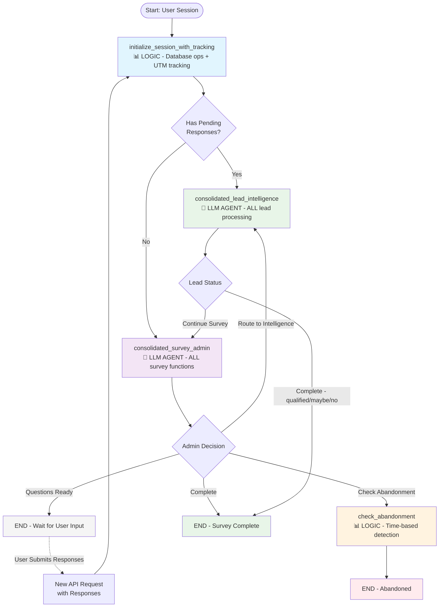

# LangGraph Implementation Architecture

This diagram represents the current simplified LangGraph implementation for the dynamic survey system.

## Architecture Overview

### Consolidated Supervisors Architecture

The system has been simplified from a complex multi-node architecture to a streamlined design with two main AI agents:

| Component | Type | Integrated Functions |
|-----------|------|---------------------|
| **initialize_session_with_tracking** | 📊 LOGIC | Database operations, UTM tracking, session setup |
| **Consolidated Survey Admin Supervisor** | 🤖 LLM AGENT | • Question selection (AI-driven) • Question phrasing & engagement • Frontend preparation • Progress tracking • Routing decisions |
| **Consolidated Lead Intelligence Agent** | 🤖 LLM AGENT | • Response saving • Score calculation • Tool usage decisions (Tavily/Maps) • Score validation & adjustment • Message generation • Status determination |
| **check_abandonment** | 📊 LOGIC | Time-based detection + database update |

### Key Features

✅ **Intelligent Question Selection**: AI-driven question ordering based on user responses  
✅ **Question Flow Strategy**: Non-deterministic flow that adapts to each user  
✅ **Score Validation**: Integrated validation with external tool support  
✅ **Tool Integration**: External validation (Tavily/Maps) for lead qualification  
✅ **Session Persistence**: State preserved between interactions via snapshots  
✅ **Abandonment Detection**: Time-based detection with automatic handling  
✅ **Business Rule Compliance**: AI selection within defined business constraints  
✅ **Performance Optimized**: Fewer LLM calls, consolidated processing  

### Routing Logic

The system uses intelligent routing based on:
- **Pending Responses**: Direct routing to lead intelligence when responses need processing
- **Lead Status**: Conditional continuation or completion based on qualification
- **Abandonment Risk**: Time-based detection triggers abandonment handling
- **Business Rules**: Survey continuation based on minimum question thresholds

### Session Management

- **HTTP-only Cookies**: Secure session management
- **Redis Backend**: Fast session state storage
- **Session Snapshots**: Complete state preservation in Supabase
- **State Recovery**: Automatic restoration of survey progress

## Implementation Files

- `/backend/app/graphs/simplified_survey_graph.py` - Main graph definition
- `/backend/app/graphs/supervisors/consolidated_survey_admin_supervisor.py` - Survey management
- `/backend/app/graphs/supervisors/consolidated_lead_intelligence_agent.py` - Lead processing
- `/backend/app/graphs/nodes/tracking_and_response_nodes.py` - Initialization logic
- `/backend/app/routes/survey_api.py` - API integration