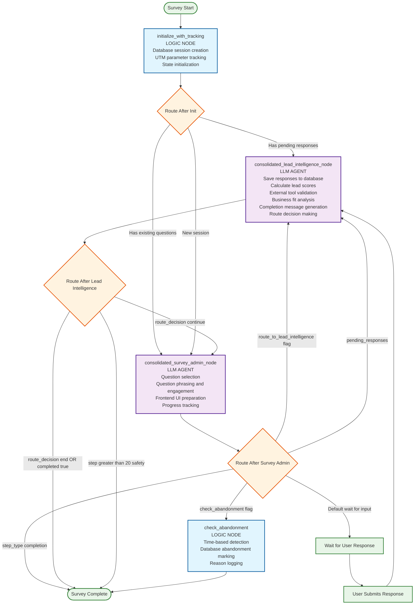

# Simplified LangGraph Flow Architecture

## Overview

The Dynamic Lead Generation system uses a simplified LangGraph implementation that consolidates multiple individual nodes into two main LLM supervisors for improved performance and maintainability. This document describes the current flow architecture as implemented in `backend/app/graphs/simplified_survey_graph.py`.

## Architecture Diagram



## Core Components

### 1. Logic Nodes (Non-LLM Processing)

#### `initialize_with_tracking`

- **File**: `backend/app/graphs/nodes/tracking_and_response_nodes.py`
- **Purpose**: Session initialization and UTM tracking
- **Responsibilities**:
  - Create database session records
  - Process UTM parameters for marketing attribution
  - Initialize state structure
  - Load existing session data if resuming

#### `check_abandonment`

- **File**: `simplified_survey_graph.py:94`
- **Purpose**: Time-based abandonment detection
- **Responsibilities**:
  - Check session activity timestamps
  - Mark sessions as abandoned in database
  - Log abandonment reasons and metrics
  - Return abandonment status

### 2. LLM Agents (AI-Powered Supervisors)

#### `consolidated_survey_admin_node`

- **File**: `backend/app/graphs/supervisors/consolidated_survey_admin_supervisor.py`
- **Model**: GPT-4.1-nano (fast, efficient)
- **Temperature**: 0.3 (balanced creativity/consistency)
- **Consolidated Responsibilities**:
  1. **Question Selection**: Choose 1-4 questions from available pool
  2. **Question Phrasing**: Adapt questions for engagement
  3. **Frontend Preparation**: Format questions for UI display
  4. **Progress Tracking**: Monitor survey completion state

#### `consolidated_lead_intelligence_node`

- **File**: `backend/app/graphs/supervisors/consolidated_lead_intelligence_agent.py`
- **Model**: GPT-3.5-turbo (cost-effective for analysis)
- **Temperature**: 0.1 (high consistency for scoring)
- **Consolidated Responsibilities**:
  1. **Response Processing**: Save responses to database
  2. **Lead Scoring**: Calculate qualification scores
  3. **Tool Integration**: Use external validation (Tavily, Maps)
  4. **Business Analysis**: Assess customer-business fit
  5. **Message Generation**: Create personalized completion messages
  6. **Route Decisions**: Determine survey continuation or completion

## Routing Logic

### Initial Routing (`route_after_initialization`)

```python
def route_after_initialization(state: SurveyState) -> str:
    # Priority 1: Process pending responses (including empty arrays for completion check)
    if pending_responses is not None:
        return "lead_intelligence"
    
    # Priority 2: Continue existing session with prepared questions
    if session_id and question_strategy.get("all_questions"):
        return "survey_administration" 
    
    # Priority 3: New session needs question preparation
    return "survey_administration"
```

### Survey Admin Routing (`route_after_survey_admin`)

```python
def route_after_survey_admin(state: SurveyState) -> str:
    # Priority 1: Explicit routing flag from survey admin
    if state.get("route_to_lead_intelligence"):
        return "lead_intelligence"
    
    # Priority 2: Legacy pending responses check
    if state.get("pending_responses"):
        return "lead_intelligence"
    
    # Priority 3: Abandonment check requested
    if state.get("check_abandonment"):
        return "check_abandonment"
    
    # Priority 4: Survey marked as complete
    if step_type == "completion":
        return END
    
    # Default: Wait for user input
    return END
```

### Lead Intelligence Routing (`route_after_lead_intelligence`)

```python
def route_after_lead_intelligence(state: SurveyState) -> str:
    # Priority 1: Survey completion
    if route_decision == "end" or completed:
        return END
    
    # Priority 2: Safety check (prevent infinite loops)
    if step > 20:
        return END
    
    # Priority 3: Continue survey
    if route_decision == "continue":
        return "survey_administration"
    
    # Default: End survey
    return END
```

## State Management

### Core State Structure

```python
{
    "core": {
        "session_id": str,
        "form_id": str,
        "step": int,
        "client_id": str
    },
    "question_strategy": {
        "all_questions": List[Dict],
        "selected_questions": List[Dict],
        "remaining_questions": List[Dict]
    },
    "lead_intelligence": {
        "responses": List[Dict],
        "current_score": float,
        "lead_status": str  # "yes", "maybe", "no"
    },
    "pending_responses": List[Dict],  # Triggers lead intelligence processing
    "route_to_lead_intelligence": bool,  # Explicit routing flag
    "route_decision": str,  # "continue" or "end"
    "completed": bool,
    "step_type": str  # "questions" or "completion"
}
```

## API Integration Points

### Survey Start

```python
async def start_simplified_survey(initial_state: dict) -> dict:
    """Entry point for POST /api/survey/start"""
    return await simplified_survey_graph.ainvoke(initial_state)
```

### Survey Step Processing

```python
async def process_survey_step(state_with_responses: dict) -> dict:
    """Process user responses for POST /api/survey/step"""
    return await simplified_survey_graph.ainvoke(state_with_responses)
```

### Abandonment Check

```python
async def check_abandonment(session_state: dict) -> dict:
    """Background abandonment detection"""
    session_state["check_abandonment"] = True
    return await simplified_survey_graph.ainvoke(session_state)
```

## Performance Optimizations

### Consolidation Benefits

1. **Reduced LLM Calls**: From 8+ individual nodes to 2 consolidated supervisors
2. **Faster Response Times**: Reduced model switching and context loading
3. **Lower Costs**: Fewer API calls and optimized model selection
4. **Simplified Debugging**: Fewer components to track and monitor

### Model Selection Strategy

- **Survey Admin**: GPT-4.1-nano for question selection creativity
- **Lead Intelligence**: GPT-3.5-turbo for cost-effective analysis
- **Timeouts**: Reduced to 10-15 seconds for faster user experience

## Error Handling & Safety

### Loop Prevention

- Maximum 20 steps per session to prevent infinite loops
- Explicit route decisions to control flow
- Default fallbacks to END state

### State Validation

```python
def validate_state_transitions(state: SurveyState) -> bool:
    required_fields = ["core", "question_strategy", "lead_intelligence"]
    # Validation logic for state consistency
```

### Abandonment Detection

- Time-based detection with configurable thresholds
- Database marking with reason logging
- Graceful session cleanup

## Toolbelt Integration

### Lead Intelligence Toolbelt

- **Database Operations**: Response saving, scoring persistence
- **External APIs**: Tavily search, Google Maps validation  
- **Scoring Logic**: Business-specific qualification rules
- **Message Generation**: Personalized completion content

### Abandonment Toolbelt

- **Time Tracking**: Activity monitoring and threshold detection
- **Database Updates**: Abandonment status and metadata
- **Analytics**: Conversion funnel metrics

## Future Considerations

### Scalability

- Current architecture supports horizontal scaling
- Redis session storage enables load balancing
- Consolidated supervisors reduce resource usage

### Monitoring

- LangSmith integration for LLM call tracking
- Database metrics for performance monitoring
- Real-time abandonment rate analysis

### Extensions

- A/B testing framework for question strategies
- ML model integration for predictive lead scoring
- Advanced personalization based on response patterns

## File Locations

- **Main Graph**: `backend/app/graphs/simplified_survey_graph.py`
- **Survey Admin**: `backend/app/graphs/supervisors/consolidated_survey_admin_supervisor.py`
- **Lead Intelligence**: `backend/app/graphs/supervisors/consolidated_lead_intelligence_agent.py`
- **State Management**: `backend/app/state.py`
- **Toolbelts**: `backend/app/graphs/toolbelts/`
- **API Integration**: `backend/app/routes/survey.py`
